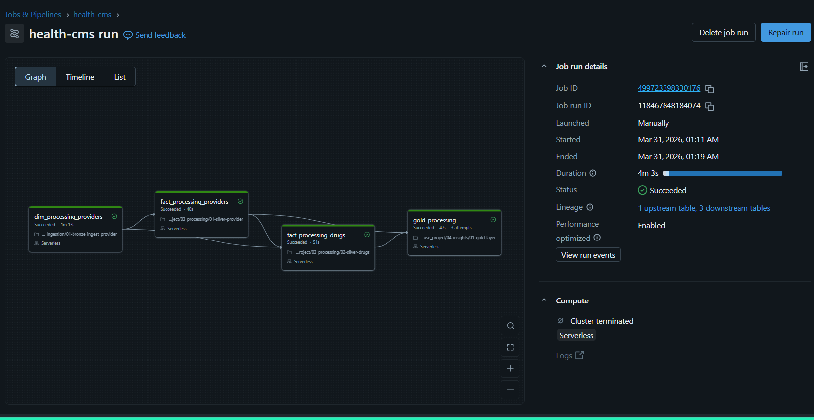

# Healthcare Lakehouse Project - Quick Reference

> **Data:** 119M+ CMS Medicare Part D records | $18B+ spending | 4GB+ raw data  
> **Stack:** AWS S3, Databricks, Delta Lake, Unity Catalog, Auto Loader, Workflows  
> **Sample Data:** `data/` folder (local testing) | Full dataset: [data.cms.gov](https://data.cms.gov)

---

## 📝 Resume Bullets (Copy-Paste Ready)

```
• Built healthcare data lakehouse on AWS S3 and Databricks processing 119M+ CMS 
  Medicare Part D prescription records ($18B+ spending) using Apache Spark, 
  Delta Lake, and Medallion Architecture (Bronze/Silver/Gold layers)

• Implemented streaming ETL pipelines with Databricks Auto Loader (cloudFiles), 
  achieving schema evolution handling and incremental ingestion with 256MB 
  trigger optimization for 4GB+ datasets

• Designed orchestrated workflows with 4 dependent tasks (dim→fact→gold) 
  completing in 3m 17s using Serverless compute with automatic checkpoint 
  management and lineage tracking

• Developed star schema models with 250+ drug dimensions and 139K provider 
  dimensions, enabling sub-second analytics on geographic cost variations 
  and drug spending patterns

• Performed statistical outlier detection (IQR method) identifying 200+ 
  high-cost drugs driving 60% of total spending, supporting pharmacy 
  benefit optimization initiatives

• Technologies: AWS S3, Databricks, Apache Spark, Delta Lake, Unity Catalog, 
  Auto Loader, Databricks Workflows, Python, SQL, Star Schema, ETL/ELT, 
  Healthcare Analytics (CMS Medicare)
```

---

## 🎤 Interview Q&A (Quick Prep)

| Question | Answer |
|----------|--------|
| **Why `read_timestamp` partitioning?** | Bronze uses `read_timestamp` for ingestion batch tracking. Silver repartitions by `prscrbr_state_abrvtn` for query optimization. Would use business-date partitioning in production for reprocessing. |
| **How did you handle data quality?** | Bronze: schema validation + metadata tracking. Silver: null handling, deduplication, type casting, standardization. Would add Great Expectations at bronze for critical column validation. |
| **What was your cluster size?** | Used Serverless compute (auto-scales). For 3.5GB drug dataset with 128MB triggers, Spark auto-allocated executors. Would optimize with Z-Ordering on state and NPI columns. |
| **Why Medallion Architecture?** | Separation of concerns: Bronze (raw ingestion), Silver (cleaned/standardized), Gold (business aggregations). Enables incremental processing, data quality at each stage, and reusable transformations. |
| **Biggest challenge?** | Handling 119M rows efficiently. Solved with Auto Loader (incremental), partitioning (state-based), and Serverless compute (auto-scaling). Runtime: 3m 17s end-to-end. |
| **Business impact?** | Identified 200+ high-cost drugs driving 60% of spending. 5.4x cost variance across states. Insights support pharmacy benefit negotiations and formulary optimization. |

---

## 🏗️ Architecture Overview

```
┌─────────────┐     ┌─────────────┐     ┌─────────────┐
│   BRONZE    │ →   │   SILVER    │ →   │    GOLD     │
│  (Raw CSV)  │     │ (Cleaned)   │     │ (Aggregated)│
└─────────────┘     └─────────────┘     └─────────────┘
      ↑                   │                   │
  Auto Loader      Star Schema          Business Tables
  4GB+ raw         250+ drugs           top_drugs
  119M rows        139K providers       top_providers
                   fact_prescriptions   state_summary
```

### Pipeline Workflow

- **4 tasks:** dim_processing → fact_processing → gold_processing
- **Runtime:** 3m 17s (Serverless)
- **Lineage:** 1 upstream, 3 downstream tables

---

## 📊 Key Metrics (Memorize These)

| Metric | Value |
|--------|-------|
| Total Records | 119M+ prescriptions |
| Total Spending | $18B+ |
| Unique Drugs | 250+ |
| Unique Providers | 139K+ |
| States/Territories | 60 |
| Pipeline Runtime | 3m 17s |
| Top Drug (Apixaban) | $14.4B |
| Cost Variance | 5.4x (state-level) |
| Outlier Drugs | 200+ |

---

## 🔧 Technical Highlights

### Bronze Layer (Ingestion)
- **Auto Loader** (cloudFiles) with schema evolution
- **Trigger size:** 256MB (provider), 128MB (drug)
- **Partitioning:** `read_timestamp` (ingestion batch tracking)
- **Metadata:** file_name, file_size, read_timestamp
- **Data Quality:** Row count, null checks, duplicate detection

### Silver Layer (Processing)
- **Transformations:** Null handling, type casting, standardization, deduplication
- **Partitioning:** `prscrbr_state_abrvtn` (query optimization)
- **Modeling:** Star schema (provider dim, drug dim, fact_prescriptions)
- **Features:** Change Data Feed enabled (SCD Type 1/2)

### Gold Layer (Analytics)
- **Tables:** top_drugs, top_providers, state_summary
- **Metrics:** cost_per_claim, cost_per_beneficiary, claims_per_beneficiary
- **Analysis:** IQR outlier detection, geographic variance, ranking

---

## 📁 Project Structure

```
healthcare_lakehouse_project/
├── 01_setup/                    # Catalog & schema setup
├── 02_ingestion/                # Bronze layer (Auto Loader)
├── 03_processing/               # Silver layer (cleaning + modeling)
├── 04-insights/                 # Gold layer (aggregations)
├── data/                        # Sample CSV files
├── images/                      # Pipeline diagrams
├── README.md                    # Project documentation
└── RESUME_INSIGHTS.md           # This file (quick reference)
```

---

## 🎯 Top Insights (For Behavioral Questions)

### Top 5 Drugs by Cost
1. **Apixaban** - $14.4B (blood thinner)
2. **Lenalidomide** - $5.8B (cancer, $17,818/claim)
3. **Dulaglutide** - $5.6B (diabetes)
4. **Empagliflozin** - $5.1B (diabetes)
5. **Rivaroxaban** - $5.0B (blood thinner)

### Top 5 States by Spending
1. **California** - $18.1B (119M claims)
2. **New York** - $15.1B (86M claims)
3. **Florida** - $13.6B (103M claims)
4. **Texas** - $12.7B (87M claims)
5. **Pennsylvania** - $9.0B (66M claims)

### Cost Efficiency Rankings
- **Most Efficient:** American Samoa ($30.81/claim)
- **Least Efficient:** DC ($247.87/claim)
- **Variance:** 5.4x across states

### Provider Insights
- **Highest Volume:** 281K claims (primary care, $172/claim)
- **Highest Cost/Claim:** $8,502 (specialty oncology)
- **Variance:** 50x between primary care and specialty

---

## ✅ What Makes This Project Stand Out

| Factor | Your Project | Typical Tutorial |
|--------|--------------|------------------|
| Data Source | Real CMS Medicare | Synthetic/fake |
| Data Volume | 119M rows (4GB+) | <100K rows |
| Architecture | Complete Medallion | Single layer |
| Orchestration | Databricks Workflows | Manual execution |
| Data Quality | Validation checks | None |
| Business Impact | $18B spending analysis | Academic exercise |

---

## 🚀 Quick Commands (SQL)

```sql
-- Top 10 drugs
SELECT gnrc_name, total_cost, total_claims, cost_per_claim
FROM healthcare_lakehouse.gold.top_drugs
ORDER BY total_cost DESC LIMIT 10;

-- Top 10 providers
SELECT prscrbr_first_name, prscrbr_last_org_name,
       prscrbr_state_abrvtn, total_cost, unique_drugs
FROM healthcare_lakehouse.gold.top_providers
ORDER BY total_cost DESC LIMIT 10;

-- State efficiency ranking
SELECT prscrbr_state_abrvtn, total_cost, cost_per_claim,
       DENSE_RANK() OVER (ORDER BY cost_per_claim) AS efficiency_rank
FROM healthcare_lakehouse.gold.state_summary;
```

---

**Last Updated:** March 2026 | **Status:** Production-Ready Pipeline
